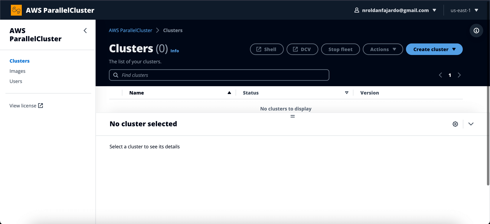
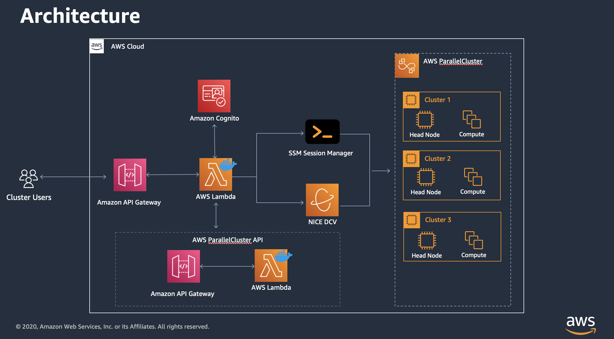

# Distributed PyTorch

## Single Node - Single GPU example

1. Start a sagemaker notebook instance with a machine with a single GPU (e.g. g4dn.xlarge: Tesla T4). When creating the notebook, point to this github repo, so once the notebook starts the code is available there.
2. Run `single_gpu.py` code in the terminal.

## Single Node - Multiple GPU example

1. Start a sagemaker notebook instance with a machine with multiple GPUs (e.g. g3.8xlarge: 2 x Tesla M60). When creating the notebook, point to this github repo, so once the notebook starts the code is available there.
2. Run `multi_gpu.py` code in the terminal.

## Multi-node - Multiple GPU example

For this, aws-parallel cluster is used. `AWS ParallelCluster` is an open source cluster management tool that makes it easy for you to deploy and manage High Performance Computing (HPC) clusters on AWS. ParallelCluster uses a simple graphical user interface (GUI) or text file to model and provision the resources needed for your HPC applications in an automated and secure manner. It also supports multiple instance types and job submission queues, and job schedulers like AWS Batch and Slurm.

References:
- https://aws.amazon.com/hpc/parallelcluster/
- https://github.com/aws/aws-parallelcluster

### Pcluster UI (Optional)

Deploy pcluster UI. The `AWS ParallelCluster UI` is a web-based user interface that mirrors the AWS ParallelCluster pcluster CLI, while providing a console-like experience: https://docs.aws.amazon.com/parallelcluster/latest/ug/install-pcui-v3.html



The stacks deploys the following:



`Note`: Put the same API version you are using for the CLI when creating the pcluster UI stack using the quick-link template. Otherwise, you will get the following error:
``` bash
    "message": "Cluster 'pytorch-cluster' does not exist or belongs to an incompatible ParallelCluster major version."
```

Note the stack name. Once deployed, check the stack outputs for the `ParallelClusterUIUrl` value. Look into your email for the password. You will prompted to enter a new one.

### Pcluster creation

For deploying a new cluster follow this guide: https://docs.aws.amazon.com/parallelcluster/latest/ug/install-v3-configuring.html 

A summarize of the steps as of October 2023 for deploying cluster to start training models in a distributed fashion is the following:
- Configure AWS CLI and CDK.
- Create virtual environment and install pcluster cli on it.
- Create a key-pair to login to the master node/headnode of the cluster.
- Create a configuration file for the cluster (headnode, workers, scheduler). You can create this file using the CLI guided command `configure`.
- Check the status of the cluster in the UI or throught the CLI.
- Once the stack has been deployed, log in to the headnode using the key-pair created before.

```bash
pip3 install awscli -U --user
pip3 install "aws-parallelcluster" --upgrade --user
# Create a configuration file 
pcluster configure --config config-file.yaml
pcluster create-cluster --cluster-name <> --cluster-configuration config.yaml
# list the clusters
pcluster list-clusters
# log in to headnode
pcluster ssh --cluster-name dist-ml -i your-keyname-file
```

Useful commands:
```bash
pcluster describe-cluster --cluster-name <cluster-name>
pcluster delete-cluster --region us-east-1 --cluster-name <cluster-name>
```

